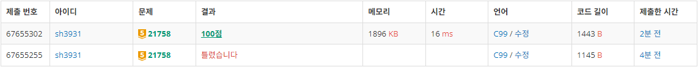
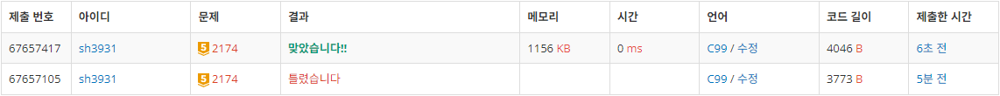

# Week 1
# 21758: 꿀 따기
- 출처: 백준 (https://www.acmicpc.net/problem/21758)

## Code
```C
#include <stdio.h>
#include <stdlib.h>

int N;
int honey[100000];
int sumArray[100000];

int maxI;
int answer;

int maxf(int a, int b) {
	return a > b ? a : b;
}

int main(void) {

    scanf("%d", &N);
    for (int i = 0; i < N; i++) {
        scanf("%d", &honey[i]);
    }
    sumArray[0] = honey[0];
    for (int i = 1; i < N; i++) {
        sumArray[i] = sumArray[i - 1] + honey[i];
        if (honey[maxI] < honey[i]) {
            maxI = i;
        }
    }

    //left side
    for (int i = N - 2; i > 0; i--) {
        int s = sumArray[N - 1] + sumArray[i] - honey[N - 1] - 2 * honey[i];
        answer = maxf(answer, s);
    }

    //right side
    sumArray[N - 1] = honey[N - 1];
    for (int i = N - 2; i >= 0; i--) {
        sumArray[i] = sumArray[i + 1] + honey[i];
    }
    for (int i = 1; i < N; i++) {
        int s = sumArray[0] + sumArray[i] - honey[0] - 2 * honey[i];
        answer = maxf(answer, s);
    }

    //middle
    if (maxI != 0 && maxI != N - 1) {
        int s = 0;
        for (int i = 1; i <= maxI; i++) {
            s += honey[i];
        }
        for (int i = N - 2; i >= maxI; i--) {
            s += honey[i];
        }
        answer = maxf(answer, s);
	}

    printf("%d", answer);
    return 0;
}
```

## Result


성공

## Access
벌통의 위치에 따라서 3가지 경우로 나누어 접근하였다.

벌통이 위치한 곳은 두 벌이 모두 꿀을 얻을 수 있으므로 벌통의 위치가 각각

- 왼쪽 끝
- 오른쪽 끝
- 꿀이 가장 많은 곳

의 경우를 각각 탐색하여 최고값을 계산하였다.


# 2174: 로봇 시뮬레이션
- 출처: 백준 (https://www.acmicpc.net/problem/2174)


## Code
```C
#include <stdio.h>
#include <stdlib.h>
#include <string.h>

int a, b, N, M;
int pass = 1;

struct robot {
    int x;
    int y;
    int num;
    char dir;
};

struct robot robots[100];
int map[101][101];

void wallB(int num) {
    printf("Robot %d crashes into the wall", num + 1);
	pass = 0;
}

void robotB(int num) {
	printf("Robot %d crashes into robot %d", num + 1, map[robots[num].x][robots[num].y] + 1);
	pass = 0;
}

void left(struct robot* robot) {
    switch (robot->dir) {
		case 'N':
			robot->dir = 'W';
			break;
		case 'W':
			robot->dir = 'S';
			break;
		case 'S':
			robot->dir = 'E';
			break;
		case 'E':
			robot->dir = 'N';
			break;
	}
}

void right(struct robot* robot) {
    switch (robot->dir) {
        case 'N':
            robot->dir = 'E';
            break;
        case 'W':
            robot->dir = 'N';
            break;
        case 'S':
            robot->dir = 'W';
            break;
        case 'E':
            robot->dir = 'S';
            break;
    }
}

void front(struct robot* r) {
    switch (r->dir) {
        case 'N':
            r->y++;
            if (r->y > b) {
                wallB(r->num);
                return;
            }
            else {
                if (map[r->x][r->y] != 0) {
                    robotB(r->num);
                    return;
                }
                else {
                    map[r->x][r->y] = r->num;
                    map[r->x][r->y - 1] = 0;
                }
            }
            break;
        case 'W':
            r->x--;
            if (r->x < 1) {
                wallB(r->num);
                return;
            }
            else {
                if (map[r->x][r->y] != 0) {
                    robotB(r->num);
                    return;
                }
                else {
                    map[r->x][r->y] = r->num;
                    map[r->x + 1][r->y] = 0;
                }
            }
            break;
        case 'S':
            r->y--;
            if (r->y < 1) {
                wallB(r->num);
                return;
            }
            else {
                if (map[r->x][r->y] != 0) {
                    robotB(r->num);
                    return;
                }
                else {
                    map[r->x][r->y] = r->num;
                    map[r->x][r->y + 1] = 0;
                }
            }
            break;
        case 'E':
            r->x++;
            if (r->x > a) {
                wallB(r->num);
                return;
            }
            else {
                if (map[r->x][r->y] != 0) {
                    robotB(r->num);
                    return;
                }
                else {
                    map[r->x][r->y] = r->num;
                    map[r->x - 1][r->y] = 0;
                }
            }
            break;
    }
}

int main(void) {
    scanf("%d %d", &a, &b);
    scanf("%d %d", &N, &M);
    for (int i = 0; i < N; i++) {
        int x, y;
        char dir;
        scanf("%d %d %c", &x, &y, &dir);
        robots[i].x = x;
        robots[i].y = y;
        robots[i].num = i;
        robots[i].dir = dir;
        map[x][y] = i;
    }
    for (int i = 0; i < M; i++) {
        if (!pass) break;
        int num, cnt;
        char order;
        scanf("%d %c %d", &num, &order, &cnt);
        switch (order) {
            case 'L':
                for (int i = 0; i < cnt; i++) {
                    if (!pass)
                        break;
                    left(&robots[num-1]);
                }
                break;
            case 'R':
                for (int i = 0; i < cnt; i++) {
                    if (!pass)
                        break;
                    right(&robots[num-1]);
                }
                break;
			case 'F':
                for (int i = 0; i < cnt; i++) {
                    if (!pass)
                        break;
                    front(&robots[num-1]);
                }
        }
    }

    if (pass) {
		printf("OK");
	}
    return 0;
}
```

## Result



## Access

각각의 동작에 함수를 만들고, 충돌을 발생시키는 F(Front) 동작에서 매 입력마다 충돌이 발생하는지 확인하고 출력하였다.