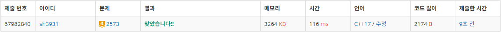
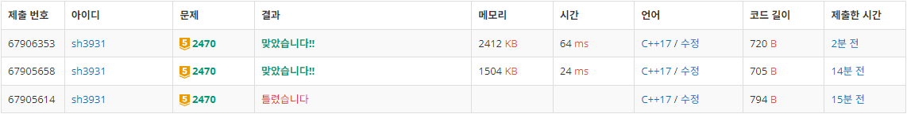
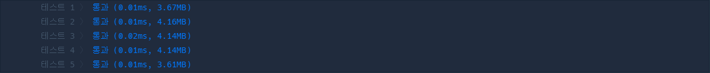

# Week 2
# 2573: 빙산
- 출처: 백준 (https://www.acmicpc.net/problem/2573)

## Code
```C++
#include <iostream>
#include <algorithm>

int N,M;
int arr[300][300];
int visit[300][300];
int melt[300][300];
int dx[4] = { 0,0,1,-1 };
int dy[4] = { 1,-1,0,0 };

bool isICE() {
    for (int i = 0; i < N; i++) {
        for (int j = 0; j < M; j++) {
            if (arr[i][j] > 0)
                return true;
        }
    }
    return false;
}

void dfs(int x, int y) {
    for (int i = 0; i < 4; i++) {
        int nx = x + dx[i];
        int ny = y + dy[i];
        if (nx < 0 || ny < 0 || nx >= N || ny >= M)
            continue;
        if (arr[nx][ny] > 0 && visit[nx][ny] == 0) {
            visit[nx][ny] = 1;
            dfs(nx, ny);
        }
    }
}

int main(void) {
    int i, j, answer;

    std::cin >> N >> M;
    for (i = 0; i < N; i++) {
        for (j = 0; j < M; j++) {
            std::cin >> arr[i][j];
        }
    }

    answer = 0;
    while (1) {
        for (i = 0; i < N; i++) {
            for (j = 0; j < M; j++) {
                visit[i][j] = 0;
                melt[i][j] = 0;
            }
        }

        // No Ice
        if (!isICE()) {
            std::cout << "0";
            break;
        }

        // calc Ice cnt
        int cnt = 0;
        for (i = 0; i < N; i++) {
            for (j = 0; j < M; j++) {
                if (arr[i][j] > 0 && visit[i][j] == 0) {
					visit[i][j] = 1;
                    cnt++;
					dfs(i, j);
				}
			}
		}
        if (cnt > 1) {
            std::cout << answer;
            break;
        }
        else
            answer++;

        // calc Melt
        for (i = 0; i < N; i++) {
            for (j = 0; j < M; j++) {
                if (arr[i][j] > 0) {
                    for (int k = 0; k < 4; k++) {
                        int nx = i + dx[k];
                        int ny = j + dy[k];
                        if (nx < 0 || ny < 0 || nx >= N || ny >= M)
                            continue;
                        if (arr[nx][ny] <= 0)
                            melt[i][j]++;
                    }
				}
			}
		}

        for (i = 0; i < N; i++) {
            for (j = 0; j < M; j++) {
                arr[i][j] -= melt[i][j];
            }
        }
    }
    return 0;
}
```

## Result

성공

## Access

dfs를 이용하여 빙산이 몇덩어리로 나누어져있는지 확인한다. 인접한 칸을 확인하며 visit 배열을 채우고 전체 count가 2 이상이라면 프로그램을 종료하며 연차를 출력한다.

얼음이 녹는 행위를 구현할 때, 각 칸이 몇만큼 녹아야 하는지 계산하여 melt 배열에 담은뒤 실제 arr에서 감소시킨다.


# 2470: 두 용액
- 출처: 백준 (https://www.acmicpc.net/problem/2470)


## Code
```C++
#include <iostream>
#include <algorithm>

int N;
int arr[100000];

int main(void) {
    int i, j;
    int a, b;
    char c;
    long long  min = 2000000000;
    long long temp_min;

    std::cin >> N;
    for (i = 0; i < N; i++) {
        std::cin >> arr[i];
    }
    i = 0;
    j = N - 1;
    std::sort(arr, arr + N);
    while (i != j) {
        temp_min = arr[i] + arr[j];
        if (abs(temp_min) < min) {
            min = abs(temp_min);
            a = arr[i];
            b = arr[j];
        }
        if (temp_min == 0)
            break;
        if (temp_min < 0)
            i++;
        else
            j--;
    }
    std::cout << a << " " << b << std::endl;
    return 0;
}
```

## Result

성공

## Access

투포인터를 이용하여 용액의 특성값을 정렬하고, 두 특성값 합의 절대값이 가장 작은 경우를 저장하여 출력한다.

특성값의 합이 음수면 앞의 포인터를 옮기고, 특성값의 합이 양수면 뒤의 포인터를 옮긴다.

두 포인터가 만날때까지 해당 작업을 반복하여 특성값의 합을 최소로 만드는 용액들의 특성값을 출력한다.


# 43163: 단어 변환
- 출처: 프로그래머스 (https://school.programmers.co.kr/learn/courses/30/lessons/43163)


## Code
```C++
#include <iostream>
#include <string>
#include <vector>
#include <algorithm>

using namespace std;

int answer = 50;
bool visited[50];

bool checkWord(string a, string b) {
    int cnt = 0;
    for (int i = 0; i < a.size(); i++) {
        if (a[i] != b[i])
            cnt++;
    }
    return (cnt == 1);
}

void dfs(string begin, string target, vector<string> words, int step) {
    if (answer <= step)
        return;
    if (begin == target) {
        answer = min(answer, step);
        return;
    }
    for (int i = 0; i < words.size(); i++) {
        if (checkWord(begin, words[i]) && !visited[i]) {
            visited[i] = true;
            dfs(words[i], target, words, step + 1);
            visited[i] = false;
        }
    }
    return;
}

int solution(string begin, string target, vector<string> words) {
    dfs(begin, target, words, 0);
    if (answer == 50) answer = 0;
    return answer;
}
```

## Result

성공

## Access
철자 하나를 변경하여 얻을 수 있는 단어들을 확인하면서 dfs를 통해 원하는 단어가 나올 때 까지 탐색하였다.

여러가지 방법이 있더라도, 기존의 정답이 현재 step(depth)보다 작다면 그 방법은 탐색을 하지 않는 방식으로 탐색의 범위를 단축했다.

최소 step을 찾기 위해 answer를 50으로 시작(단어는 최대 50개)하였으며, 목적 단어를 찾지 못한 경우, 0을 반환한다.