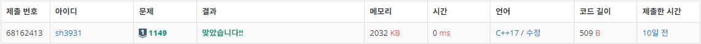
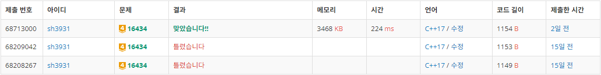

# Week 3 (1030-1105)
# 1149: RGB거리
- 출처: 백준 (https://www.acmicpc.net/problem/1149)

## Code
```C++
#include <iostream>
#include <string>
#include <vector>
#include <algorithm>

using namespace std;

int N;
int house[1000][3];

int main(void) {
    int cost[3];
    cin >> N;
    for (int i = 0; i < N; i++) {
        cin >> cost[0] >> cost[1] >> cost[2];
        for (int j = 0; j < 3; j++) {
            house[i][j] = min(house[i - 1][(j + 1) % 3], house[i - 1][(j + 2) % 3]) + cost[j];
        }
    }
    cout << min(min(house[N - 1][0], house[N - 1][1]), house[N - 1][2]) << endl;
    return 0;
}
```

## Result

성공

## Access
house 배열의 house[n][color]는 n번째 집의 색깔이 color일 때 최소 비용이다. 이전 집과는 다른 색으로 집을 칠해야 하기 때문에 이전 집의 다른 두가지 색깔 중 더 적은 비용에 해당 색깔을 칠하는 비용을 더해 n번째 집의 색깔별 비용을 구할 수 있다.

따라서 최종적으로 마지막 집이 칠해지는 세가지 색깔의 경우 중 최소비용을 선택하면 전체 집을 조건에 맞추어 색칠하는 최소비용을 구할 수 있다.


# 16434: 드래곤 앤 던전
- 출처: 백준 (https://www.acmicpc.net/problem/16434)


## Code
```C++
#include <iostream>
#include <string>
#include <vector>
#include <algorithm>

using namespace std;

int N, Atk;
int room[123456][3];
long long HP;

bool calcHP(long long mid) {
    long long atk = Atk;
    long long hp = mid;
    for (int i = 0; i < N; i++) {
        if (room[i][0] == 1) {
            //monster
            long long atkcnt = (long long)room[i][2] / atk + (room[i][2] % atk != 0) - 1;
            hp -= atkcnt * (long long)room[i][1];
            if (hp <= 0) {
                return false;
            }
        }
        else {
            //heal
            atk += (long long)room[i][1];
            hp = hp + (long long)room[i][2] > mid ? mid : hp + (long long)room[i][2];
        }
    }
    return true;
}

int main(void) {
    cin >> N >> Atk;
    for (int i = 0; i < N; i++) {
        int t;
        cin >> room[i][0] >> room[i][1] >> room[i][2];
    }

    long long left = 1;
    long long right = (long long)N * 1000000 * 1000000;
    while (left <= right) {
        long long mid = (left + right) / 2;
        if (calcHP(mid)) {
            right = mid - 1;
            HP = mid;
        }
        else {
            left = mid + 1;
        }
    }

    cout << HP << endl;
    return 0;
}
```

## Result

성공

## Access
체력의 최소치와 최대치를 기준으로 이분탐색을 진행하였다. 해당 체력으로 입력에 주어진 던전을 해결할 수 있으면 더 적은 체력으로 던전을 클리어할 수 있는지 확인하는 방법으로 진행하였다.

문제 해결간에 while문 조건을 left<right 로 진행하여 정답을 해결하지 못하는 기간이 존재하였다.


# 43163: 징검다리 건너기
- 출처: 프로그래머스 (https://school.programmers.co.kr/learn/courses/30/lessons/64062)


## Code
```C++
#include <iostream>
#include <string>
#include <vector>
#include <algorithm>

using namespace std;

bool check(vector<int> stones, int k, int mid){
    int cnt=0;
    for(int i=0; i<stones.size(); i++){
        if(stones[i]<mid) cnt++;
        else cnt=0;
        if(cnt==k) return false;
    }
    return true;
}

int solution(vector<int> stones, int k) {
    int answer = 0;
    int left = *min_element(stones.begin(),stones.end())-1;
    int right = *max_element(stones.begin(),stones.end())+1;
    while(left <= right){
        int mid = (left + right) / 2;
        if(check(stones,k,mid)){
            left = mid + 1;
            answer = mid;
        }
        else{
            right = mid - 1;
        }
    }
    return answer;
}
```

## Result

성공

## Access
건널 수 있는 인원을 이분탐색하였다. 건널 수 있는 인원의 최소치는 가장 무게가 작은 돌, 최대치는 가장 무거운 돌의 수치로 계산하였다. 또한 특정 인원만큼이 건너가기 위해서는 인원수보다 가벼운 돌이 k개만큼 연속되면 안되므로 조건 탐색에 반영하였다.

이분탐색으로 해결하기 이전에 슬라이딩 윈도우를 이용하여 문제를 해결하려고 하였다. 인원이 다리를 건널때마다 무게를 줄이고, 무게가 0 이하인 돌을 발견하면 이전 k개가 0인지 확인하는 방법이다. 하지만 단순 구현으로는 시간 초과가 발생하여 이진탐색을 이용하여 문제를 해결하였다.