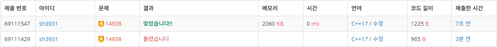
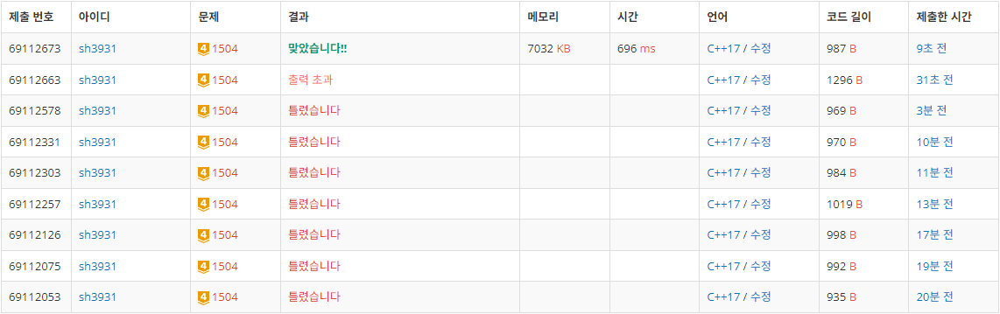

# Week 4 (1106-1112)
# 14938: 서강그라운드
- 출처: 백준 (https://www.acmicpc.net/problem/14938)

## Code
```C++
#include <iostream>
#include <string>
#include <algorithm>

using namespace std;

int ans, n, m, r;
int item[101];
int graph[101][101];

int main(void) {
    cin >> n >> m >> r;
    for (int i = 1; i <= n; i++) {
        cin >> item[i];
    }
    for (int i = 1; i <= n; i++) {
        for (int j = 1; j <= n; j++) {
            if (i != j)
                graph[i][j] = 16;
        }
    }
    for (int i = 0; i < r; i++) {
        int a, b, c;
        cin >> a >> b >> c;
        graph[a][b] = graph[b][a] = c;
    }
    for (int i = 1; i <= n; i++) {
        for (int j = 1; j <= n; j++) {
            for (int k = 1; k <= n; k++) {
                if (graph[j][k] > graph[j][i] + graph[i][k])
                    graph[j][k] = graph[j][i] + graph[i][k];
            }
        }
    }
    for (int i = 1; i <= n; i++) {
        int tmp = 0;
        for (int j = 1; j <= n; j++) {
            if (graph[i][j] <= m)
                tmp += item[j];
        }
        ans = max(ans, tmp);
    }

    cout << ans << endl;

    return 0;
}
```

## Result

성공

## Access
각 노드간 이동에 필요한 최소거리를 계산하여 저장한 뒤 수색범위를 넘지 않는 한에서 구할 수 있는 모든 item의 최대값을 구한다. (플로이드-워셜 알고리즘)

처음 문제를 해결하는 과정에서 최소거리를 계산할 때 graph의 값을 초기화하지 않아 문제 해결에 실패하였다.


# 1504: 특정한 최단 경로
- 출처: 백준 (https://www.acmicpc.net/problem/1504)


## Code
```C++
#include <iostream>
#include <string>
#include <algorithm>
#define INF 987654321

using namespace std;

long long ans;
int n, e, v1, v2;
long long graph[801][801];

int main(void) {
    cin >> n >> e;
    for (int i = 1; i <= n; i++) {
        for (int j = 1; j <= n; j++) {
            if (i != j)
                graph[i][j] = INF;
        }
    }

    for (int i = 0; i < e; i++) {
        long long a, b, c;
        cin >> a >> b >> c;
        graph[a][b] = graph[b][a] = c;
    }

    cin >> v1 >> v2;

    for (int i = 1; i <= n; i++) {
        for (int j = 1; j <= n; j++) {
            for (int k = 1; k <= n; k++) {
                if (graph[j][k] > graph[j][i] + graph[i][k])
                    graph[j][k] = graph[j][i] + graph[i][k];
            }
        }
    }

    ans = min(graph[1][v1] + graph[v1][v2] + graph[v2][n], graph[1][v2] + graph[v2][v1] + graph[v1][n]);
    if (ans >= INF)
        cout << -1 << endl;
	else
        cout << ans << endl;

    return 0;
}
```

## Result

성공

## Access
위 14938번 문제와 동일하게 모든 노드의 최소거리를 계산하여 v1노드와 v2노드가 지나는 경우(1-v1-v2-N 혹은 1-v2-v1-N)를 계산하여 최소인 값을 출력하였다.

문제 해결간에 노드간 거리의 범위를 생각하지 못하여 오버플로우가 발생하거나 ans가 INF와 같은경우를 고려하지 못하여 정답을 해결하지 못하는 기간이 존재하였다.


# 92344: 파괴되지 않은 건물
- 출처: 프로그래머스 (https://school.programmers.co.kr/learn/courses/30/lessons/92344)


## Code
```C++
#include <string>
#include <vector>
#include <algorithm>
#include <iostream>

using namespace std;

int solution(vector<vector<int>> board, vector<vector<int>> skill) {
    int answer = 0;

    vector<vector<int>> dmg(board.size() + 1, vector<int>(board[0].size() + 1));

    for (int i = 0; i < skill.size(); i++) {
        int d = skill[i][5] * (skill[i][0] == 1 ? -1 : 1);
        dmg[skill[i][1]][skill[i][2]] += d;
        dmg[skill[i][1]][skill[i][4] + 1] -= d;
        dmg[skill[i][3] + 1][skill[i][2]] -= d;
        dmg[skill[i][3] + 1][skill[i][4] + 1] += d;
    }

    for (int i = 0; i < board[0].size(); i++) {
        for (int j = 0; j < board.size(); j++) {
            dmg[j][i + 1] += dmg[j][i];
        }
    }
    for (int i = 0; i < board.size(); i++) {
        for (int j = 0; j < board[0].size(); j++) {
            dmg[i + 1][j] += dmg[i][j];
        }
    }

    for (int i = 0; i < board.size(); i++) {
        for (int j = 0; j < board[0].size(); j++) {
            board[i][j] += dmg[i][j];
            if (board[i][j] > 0)
                answer++;
        }
    }
    return answer;
}
```

## Result

성공

## Access
최초에 단순구현으로 시도 해 보았지만 단순 구현으로는 시간 초과가 발생하여 누적합을 이용하여 문제를 해결하였다.

1차원 누적합시 arr의 인덱스 a부터 b까지 c를 더해준다면 새로운 new_arr을 선언하여 new_arr[a]에 +c, new_arr[b+1]에 -c를 넣어주어 누적합을 해주면 a부터 b까지 c로 채워지며 이 배열을 기존의 배열에 더하여 문제를 해결할 수 있다.

2차원 누적합의 경우 a1,b1부터 a2,b2까지 c를 더한다고 가정하면 아래와 같은 과정을 거칠 수 있다.

|  |b1|  |  |b2|  |
|--|--|--|--|--|--|
|a1| c| 0| 0| 0|-c|
|  | 0| 0| 0| 0| 0|
|  | 0| 0| 0| 0| 0|
|b2| 0| 0| 0| 0| 0|
|  |-c| 0| 0| 0| c|

위 상태에서 가로줄로 누적합을 한 뒤,

|  |b1|  |  |b2|  |
|--|--|--|--|--|--|
|a1| c| c| c| c| 0|
|  | 0| 0| 0| 0| 0|
|  | 0| 0| 0| 0| 0|
|b2| 0| 0| 0| 0| 0|
|  |-c|-c|-c|-c| 0|

그 상태로 세로줄로 누적합을 진행하면,

|  |b1|  |  |b2|  |
|--|--|--|--|--|--|
|a1| c| c| c| c| 0|
|  | c| c| c| c| 0|
|  | c| c| c| c| 0|
|b2| c| c| c| c| 0|
|  | 0| 0| 0| 0| 0|

해당 배열을 기존 배열에 더하여 원하는 범위만큼 c를 더할 수 있다.

위 방법을 이용하여 skill에 대한 누적합 배열을 만들어 방벽에 더한 뒤 양수의 개수를 계산하였다.