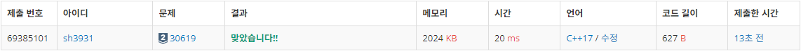
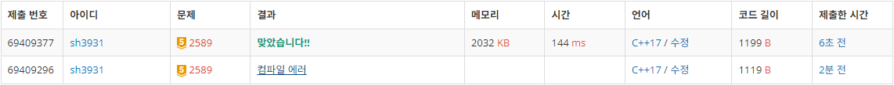

# Week 5 (1113-1119)
# 30619: 내 집 마련하기
- 출처: 백준 (https://www.acmicpc.net/problem/30619)

## Code
```C++
#include <iostream>
#include <string>
#include <algorithm>

using namespace std;

int N, M, L, R;
int A[301];
int I[301];
int ans[301];

int main(void) {
    cin >> N;
    for (int i = 1; i <= N; i++) {
        cin >> A[i];
        I[A[i]] = i;
    }
    cin >> M;
    for (int i = 0; i < M; i++) {
        for (int j = 1; j <= N; j++) {
            I[A[j]] = j;
        }
        cin >> L >> R;

        sort(I+L,I+R+1);

        for (int j = 1; j <= N; j++) {
            ans[I[j]] = j;
        }
        for (int j = 1; j <= N; j++) {
            cout << ans[j] << " ";
        }
        cout << endl;
    }

    return 0;
}
```

## Result

성공

## Access
각 사람이 몇번째 집을 배정받았는지 I배열에 저장한 뒤 입력받은 범위만큼을 오름차순 정렬하면 각 사람이 어떤 집을 배정받았는지 알 수 있다.

해당 정보를 이용해 각 집을 어떤 사람이 배정받았는지 출력한다.


# 30618: donstructive
- 출처: 백준 (https://www.acmicpc.net/problem/30618)


## Code
```C++
#include <iostream>
#include <string>
#include <algorithm>

using namespace std;

int N;
int A[200001];

int main(void) {
    cin >> N;
    for (int i = 0; i <= N; i++) {
        if (i % 2 == 0) {
            A[i / 2] = i;
        }
        else {
            A[N - i / 2] = i;
		}
    }
    for (int i = 1; i <= N; i++) {
        cout << A[i] << " ";
    }
    cout << endl;

    return 0;
}
```

## Result

성공

## Access
큰 수를 가운데로, 작은 수를 가장자리로 배치시킨다는 생각으로 구현하여 성공하였다.


# 2589: 보물섬
- 출처: 백준 (https://www.acmicpc.net/problem/2589)


## Code
```C++
#include <iostream>
#include <string>
#include <algorithm>
#include <queue>

using namespace std;

int N, M, ans;
char A[50][50];
int visit[50][50];

int dx[4] = { -1,1,0,0 };
int dy[4] = { 0,0,1,-1 };

int bfs(int x, int y) {
    int ret = 0;
    for (int i = 0; i < N; i++) {
        for (int j = 0; j < M; j++) {
            visit[i][j] = -1;
        }
    }
    queue<pair<int, int>> q;
    visit[x][y] = 0;

    q.push({ x,y });
    while (!q.empty()) {
		int x = q.front().first;
		int y = q.front().second;
		q.pop();
        for (int i = 0; i < 4; i++) {
			int nx = x + dx[i];
			int ny = y + dy[i];
            if (0 <= nx && nx < N && 0 <= ny && ny < M) {
                if (A[nx][ny] == 'L' && visit[nx][ny] == -1) {
					visit[nx][ny] = visit[x][y] + 1;
					q.push({ nx,ny });
                    ret = max(ret, visit[nx][ny]);
				}
			}
		}
	}

    return ret;
}

int main(void) {
    cin >> N >> M;
    for (int i = 0; i < N; i++) {
        cin >> A[i];
    }

    for (int i = 0; i < N; i++) {
        for (int j = 0; j < M; j++) {
            if (A[i][j] == 'L') {
                ans = max(ans, bfs(i, j));
            }
        }
    }
    cout << ans << endl;

    return 0;
}
```

## Result

성공

## Access
육지의 모든 지점에서 BFS를 이용하여 모든 거리를 구한 뒤 최대값을 계산하였다.