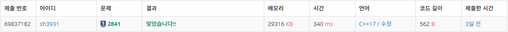
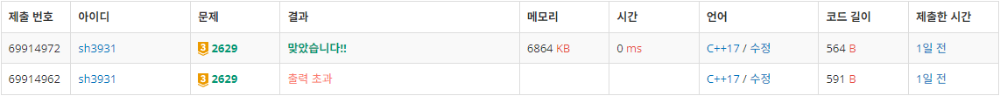

# Week 7 (1127-1203)
# 2841: 외계인의 기타 연주
- 출처: 백준 (https://www.acmicpc.net/problem/2841)

## Code
```C++
#include <iostream>
#include <algorithm>
#include <vector>

using namespace std;

int N,P;

int main()
{
    int cnt = 0;
    cin >> N >> P;
    vector<vector<int>> stack = vector<vector<int>>(N, vector<int>(1, 0));
    
    for(int i=0;i<N;i++){
        int l, p;
        cin >> l >> p;
        while(stack[l - 1].back()>p){
            stack[l - 1].pop_back();
            cnt++;
        }
        if(stack[l - 1].back()==p){
            continue;
        }
        stack[l - 1].push_back(p);
        cnt++;
    }
    
    cout << cnt << endl;

    return 0;
}
```

## Result

성공

## Access
줄만큼의 스택을 만들어 크기(플랫)를 비교해 횟수를 계산한다.


# 2629: 양팔저울
- 출처: 백준 (https://www.acmicpc.net/problem/2629)


## Code
```C++
#include <iostream>
#include <algorithm>

using namespace std;

int N, M;
int c[30];
int b[7];
int dp[31][40001];

void sol(int n, int w){
    if(n > N || dp[n][w]) return;
    dp[n][w] = 1;
    sol(n + 1, w + c[n]);
    sol(n + 1, abs(w - c[n]));
    sol(n + 1, w);
}

int main()
{
    cin >> N;
    for(int i=0; i<N; i++){
        cin >> c[i];
    }
    
    cin >> M;
    for(int i=0; i<M; i++){
        cin >> b[i];
    }
    
    sol(0,0);
    
    for(int i=0; i<M; i++){
        if(dp[N][b[i]]) cout << "Y ";
        else cout << "N ";
    }
    return 0;
}
```

## Result

성공

## Access
처음 문제를 해결할 때, 재귀를 고려하지 못하고 메인 함수에서 직접 구현을 시도하였다. 결국 해결하지 못하여 풀이를 찾아보아 재귀함수로 dp배열을 채워나갔다.

dp를 이용하여 dp[(n번까지의 추 이용)][(측정 가능 무게)]에 0과 1을 담아 해결하였다.


# 84021: 퍼즐 조각 채우기
- 출처: 프로그래머스 (https://school.programmers.co.kr/learn/courses/30/lessons/84021)


## Code
```C++
```

## Result
미해결

## Access
보드판의 구멍과 테이블의 블럭의 모양을 bfs로 큐에 담아 문제를 풀이하는 과정에서 결국 문제를 해결하지 못하였다.