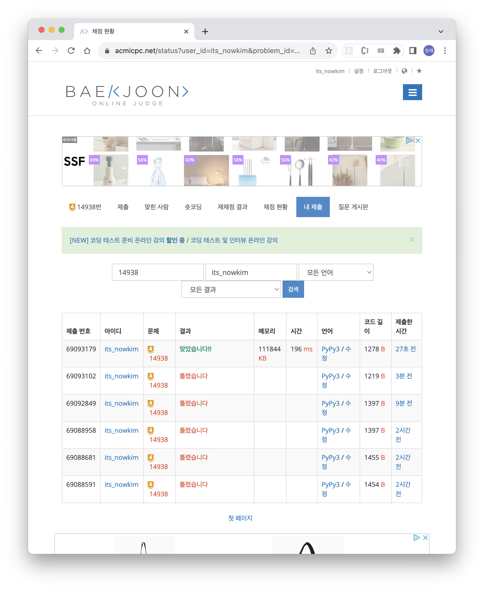

# 서강그라운드 - 14938
첫 시도 : 18% 에서 fail

다른 예제도 직접 만들고 검토도 하고 로직도 수정해 봤다.
- 예제 다른거 만들고 테스트
- INF 더 큰 값으로 변경
- deque -> heap 으로 변경
- cost 계산을 모든 distance 계산 후 계산하는 것으로 변경 (성공)

결론은 알고리즘 로직이 잘못되었던 것이었다.
m 보다 작은 경우에 갈 수 있기 때문에, 해당 경우에만 더해주면 된다.
하지만, m 조건을 거리를 계산할 때 구하면 fail 이 된다.

그 이유는 돌아갈 경우에 m 보다 작아질 경우를 무시하게 되기 때문이다.

이 조건 때문에 틀렸는데, cost 연산을 마지막에 해 준다면,
처음 접근대로 deque 로 해도 상관 없을 것 같다.
(그 대신 다음 node 로 가기 전에 정렬 해야 함 - 따라서 heap 쓰는 게 더 효율적)

# 특정한 최단 경로 - 1504
첫 시도 : 78% 에서 fail

뭔가 생각하지 못한 edge case 에서 틀린 것을 알 수 있었다.
그 이유는 경로가 없을 경우 -1 을 출력해야 하는데, 그렇지 않아서였다.

해당 경우는 answer 이 설정한 INF 보다 큰 경우이기 때문에, 해당 조건을 마지막에 넣어서 해결했다.

# 파괴되지 않은 건물 - prog92344
첫 시도 : 성공

최근 학교 과제 중 cummulate sum 알고리즘을 사용해서 matrix 의 누적합을 구하는 문제가 있었다.
그래서 쉽게 풀 수 있었다.

아이디어는 "업데이트할 최종 matrix 정보를 가지고 마지막에 업데이트" 이다.
해당 update 는 시작점과 끝점을 기록하고, 한 번의 순회로 matrix 를 업데이트 하는 것이다.

skill 의 정보를 업데이트하는 matrix 는 O(N^2) 으로 만들 수 있고,
따라서 최종 알고리즘은 O(n^2) + O(n^2) 이다.

만약 매번 계산한다면 O(n^3) 이 되어 실패할 것이다.
